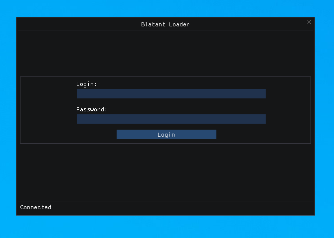
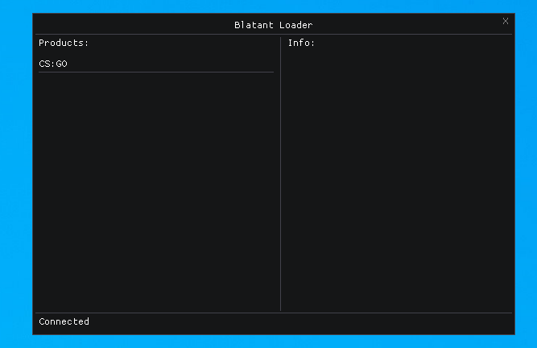
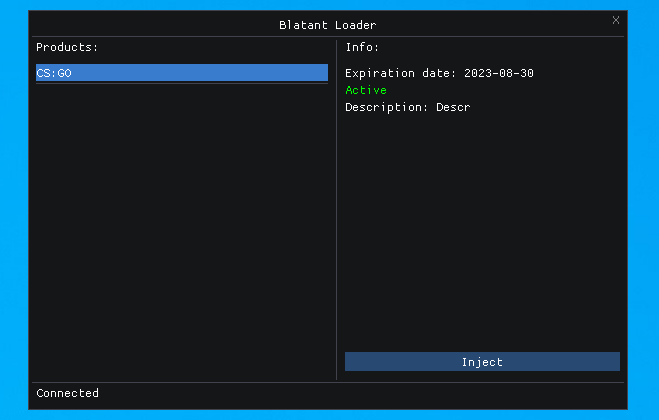

## About The Client

Desktop client to load dll from server in target process

## Getting Started
All you need to build is the boost libraries

### Installation
1. Download boost [https://boostorg.jfrog.io/artifactory/main/release/1.83.0/source/](https://boostorg.jfrog.io/artifactory/main/release/1.83.0/source/)
2. Start bootstrap.bat
3. Start  b2.exe
4. Add includes from boost to project includes folder (includes/boost)
5. Add libs from created stage/lib to project lib folder

## Usage
Change serverHost and serverPort in restClient.h

## Features
* Simple debugger check
* Simple openProcess hook
* Simple app hash check
* Hide thread from debugger
* Manual map injection
* Tls v1.3
* JWT
* HWID generator
* XorStr
* Obfuscator
* JSON serializer

## Credits
* Thx to [andrivet](https://github.com/andrivet) for obfuscator [Repository](https://github.com/andrivet/ADVobfuscator)
* Thx to [KN4CK3R](https://github.com/KN4CK3R) for XorStr [Repository](https://github.com/KN4CK3R/XorStr/tree/master)
* Thx to [TheCruZ](https://github.com/TheCruZ) for MMap example [Repository](https://github.com/TheCruZ/Simple-Manual-Map-Injector)
* Thx to [ocornut](https://github.com/ocornut) for ImGui [Repository](https://github.com/ocornut/imgui)

## License

Distributed under the MIT License.See `LICENSE.txt` for more information.
